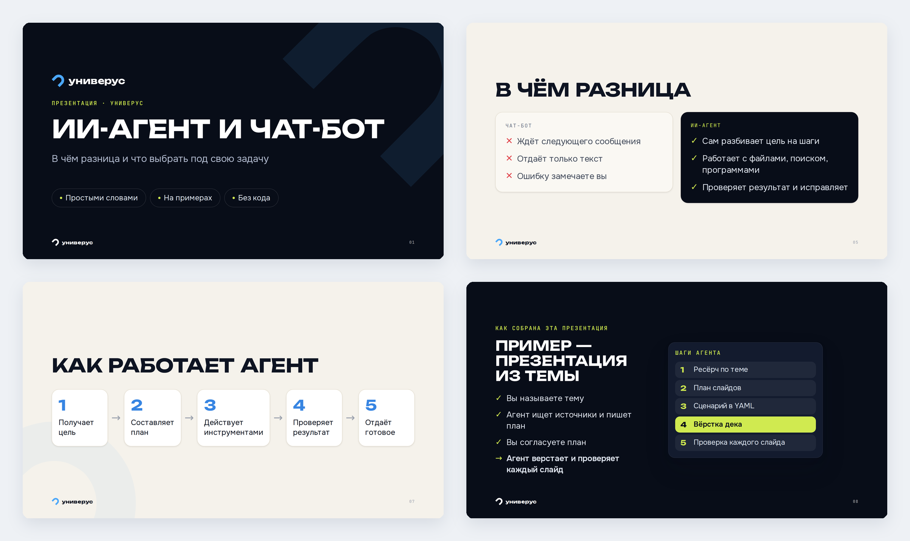

# Презентатор — slides-agent

Навык для Claude Code, Codex и ChatGPT: создаёт презентации в стиле Универус. Достаточно написать тему и попросить сделать презентацию. Если у вас есть текст, файл, ссылка или фотографии, их можно добавить к запросу, но это не обязательно.



<sub>Демо «ИИ-агент и чат-бот»: [сценарий](examples/ai-agent-vs-chatbot/slides.yaml) и [готовый HTML-дек](examples/ai-agent-vs-chatbot/ai-agent-vs-chatbot-deck.html).</sub>

## Результат

Агент сам создаёт сценарий слайдов и собирает:

| Файл | Применение |
|---|---|
| `*-deck.html` | Самодостаточная презентация: открыть в браузере, листать стрелками, работает без интернета |
| `*.pptx` | PowerPoint или Keynote с заметками докладчика; каждый слайд — изображение, поэтому текст внутри PowerPoint не редактируется |
| `*.pdf` | Раздача и печать |
| `*-mobile.html` | Вертикальная лента для телефона |
| `png/` | Кадры для проверки каждого слайда |

Вам не нужно готовить `slides.yaml` или объяснять, из какого файла взята идея. Агент составит план, при необходимости проверит факты по источникам, соберёт презентацию и просмотрит каждый слайд. Если вы прямо попросите сначала согласовать план, он покажет план до сборки. [Единые правила](skills/slides/references/workflow.md) используют все три среды.

## Установка и запуск

Пошаговые инструкции для macOS, Windows и ChatGPT — в [INSTALL.md](INSTALL.md). Кратко:

**Claude Code** (нужен доступ к приватному репозиторию):

```bash
claude plugin marketplace add nickonai/slides-agent
claude plugin install slides-agent@slides-agent
```

**Codex:** откройте клон репозитория в Codex и попросите «Сделай презентацию про …». `AGENTS.md` и локальный навык содержат ссылки на одни и те же правила.

**ChatGPT:** создайте ZIP навыка и загрузите его в разделе Plugins → Skills → Create → Upload from your computer, если эта функция доступна в вашем аккаунте:

```bash
python3 scripts/package_skill.py
```

Получится `dist/slides-skill.zip` — готовый к загрузке пакет навыка. После установки просто напишите запрос, как в примере ниже.

Пример запроса в любой среде:

```text
Сделай презентацию про семейный бюджет для новичков на 10 слайдов.
```

## Свой бренд

Скопируйте [пример конфигурации](skills/slides/brand.example.yaml) в рабочий проект под именем `brand.yaml`. Можно изменить название, логотип, палитру, шрифты и финальную плашку. По умолчанию применяется пресет Универус. Сборка печатает имя и путь найденного бренда первой строкой.

## Как устроен репозиторий

- [`AGENTS.md`](AGENTS.md) — точка входа для Codex в репозитории.
- [`CLAUDE.md`](CLAUDE.md), [`.claude-plugin/`](.claude-plugin/) — точка входа и плагин Claude Code.
- [`skills/slides/`](skills/slides/) — переносимый навык с правилами, генератором и ресурсами; именно он попадает в ZIP для ChatGPT.
- [`examples/`](examples/) — исходник и готовый HTML-пример.

## Лицензия

Код и документация — MIT, см. [LICENSE](LICENSE). Шрифты Unbounded, Onest и JetBrains Mono — SIL Open Font License 1.1; тексты лежат рядом со шрифтами. Название и логотип Универус в `skills/slides/presets/univerus/` остаются товарным знаком правообладателя и не входят в MIT-лицензию. Для стороннего бренда замените их через `brand.yaml`.
